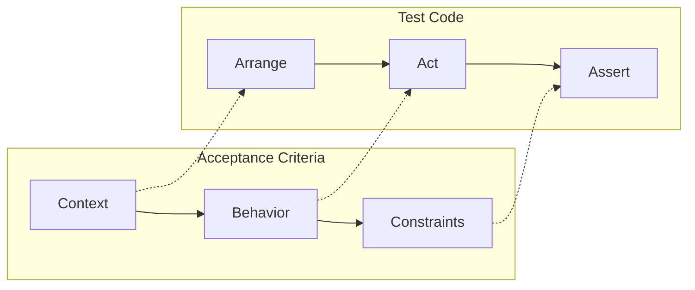

a colleague introduced me to gherkin (given/when/then) and i liked the idea but wasn't a fan of the execution. too verbose. mixes setup with inputs. no place for edge cases.

but here's the real issue: gherkin was designed for product, design, and engineering to align. it wasn't designed for ai agents. i had to test whether llms could even parse it reliably.. and the answer was "barely."

so i made my own format. **context-behavior-constraint (CBC)**. structured for humans and machines.


## the problem with common formats

| format | what's wrong |
|--------|--------------|
| prose | ambiguous, buries edge cases, hard for llms to parse |
| gherkin | verbose, no constraint section, "should" language |
| checklists | no structure, can't tell setup from outcome |
| user stories | "as a... i want..." is motivation, not behavior |

the insight: tests have a natural structure. **arrange-act-assert**. acceptance criteria should mirror that.



## the format

```markdown
**context**
- actor: who/what triggers this behavior
- preconditions: state that must exist before (test fixtures)
- inputs: function arguments or request parameters

**behavior**
- when: the trigger action (function call)
- then: primary expected outcome
- and: additional outcomes (each becomes an assertion)

**constraints**
- edge case: boundary condition → expected handling
- non-goal: explicitly out of scope for this story
```

that's it. every field maps directly to test code.

## field → test code mapping

| field | purpose | test code |
|-------|---------|-----------|
| `actor` | who performs the action | test class name |
| `preconditions` | state before test | `setUp()`, fixtures |
| `inputs` | values passed in | function arguments |
| `when` | the action | function call |
| `then` | primary assertion | `assert` |
| `and` | additional assertions | more `assert`s |
| `edge case` | boundary conditions | separate test methods |
| `non-goal` | scope boundaries | what NOT to test |

## real example

here's an actual AC from a blend scoring feature:

```markdown
### 1. Direct Signal Match

**context**
- actor: blend service
- preconditions: dan has SIGNALS edge to franklins with strength 90
- inputs: collection_id="austin_bbq", andee_id="dan"

**behavior**
- when: blend_collection(collection_id, andee_id)
- then: franklins.score = 90
- and: franklins.score_breakdown.direct_signal = 90
- and: franklins.reasons includes "You love this (90)"

**constraints**
- edge case: direct signal is negative → item ranks lowest
- non-goal: blending items dan created (always show those)
```

and the test it generates:

```python
class TestBlendDirectSignalMatch:
    """AC 1: Direct Signal Match"""

    @pytest.fixture
    def setup_dan_signals(self, neo4j_service):
        """preconditions: dan has SIGNALS edge to franklins"""
        neo4j_service.create_signals_edge(
            andee_id="dan",
            content_id="franklins",
            strength=90
        )

    def test_direct_signal_match(self, setup_dan_signals, blend_service):
        """when: blend_collection → then: franklins.score = 90"""
        # inputs
        collection_id = "austin_bbq"
        andee_id = "dan"

        # when
        result = blend_service.blend_collection(collection_id, andee_id)

        # then
        assert result["franklins"].score == 90

        # and
        assert result["franklins"].score_breakdown.direct_signal == 90
        assert "You love this (90)" in result["franklins"].reasons

    def test_negative_signal_ranks_lowest(self, neo4j_service, blend_service):
        """edge case: direct signal is negative → item ranks lowest"""
        neo4j_service.create_signals_edge("dan", "bad_place", strength=-80)

        result = blend_service.blend_collection("austin_bbq", "dan")

        assert result["bad_place"].score == min(r.score for r in result.values())
```

notice how the test basically writes itself. each AC field has a home in the test.

## why constraints matter

the `constraints` section is the secret weapon. it captures two things:

**edge cases.** boundary conditions that need their own tests. without this, edge cases get buried in prose or forgotten entirely.

**non-goals.** what's explicitly out of scope. this prevents scope creep. when someone asks "should we also handle X?" you can point to the non-goal and say "not in this story."

## why this works for ai coding

when i'm [coding with claude](/posts/the-system), the CBC format makes AC trivially parseable:

```python
context = parse_section("context")
preconditions = context["preconditions"]  # direct access
```

with prose, claude has to infer: "before the test runs, we need to... which means..."

inference = drift. explicit labels = precision.

this ties into my [test-first enforcement](/posts/test-first-enforcement). plans must include test files, and CBC makes those tests obvious to generate.

## why not gherkin?

i tried gherkin. here's the same behavior:

```gherkin
Given dan has a SIGNALS edge to franklins with strength 90
And the collection "austin_bbq" contains franklins
When I call blend_collection with collection_id="austin_bbq" and andee_id="dan"
Then franklins.score should be 90
And franklins.score_breakdown.direct_signal should be 90
And franklins.reasons should include "You love this (90)"
```

problems:
- every line needs given/when/then prefix (verbose)
- no separation between preconditions and inputs
- no edge case section
- "should be" is ambiguous (MUST vs SHOULD?)
- where do non-goals go?

gherkin is fine for documentation. it's not great for test generation.

## template

here's what i use for stories:

```markdown
# X.Y Story Title

> **Priority:** P0/P1/P2

## Story

As [actor], I [action] so that [outcome].

## Why

| Without This | With This |
|--------------|-----------|
| Problem 1 | Solution 1 |

---

## Acceptance Criteria

### 1. First Behavior

**context**
- actor: ...
- preconditions: ...
- inputs: ...

**behavior**
- when: ...
- then: ...
- and: ...

**constraints**
- edge case: ...
- non-goal: ...

---

### 2. Second Behavior

(repeat)

---

## Definition of Done

- [ ] Tests cover all acceptance criteria
- [ ] Edge cases have dedicated tests
```

## when to use this

**use CBC for:**
- user stories that need tests
- bug reports with reproduction steps
- any behavior spec an llm will implement

**don't use CBC for:**
- design exploration (use prose)
- api docs (use openapi)
- architecture decisions (use adrs)

## the tradeoff

CBC is more rigid than prose. simple stories still need the full structure. but the payoff is:

- claude can generate tests directly from AC
- reviewers can scan quickly (labels as anchors)
- edge cases are explicit, not buried
- non-goals prevent "while we're at it..." creep

for my [ai coding workflow](/posts/the-system), that tradeoff is worth it every time.

---

*thanks to a colleague who introduced me to gherkin. the frustration led to something better.*
