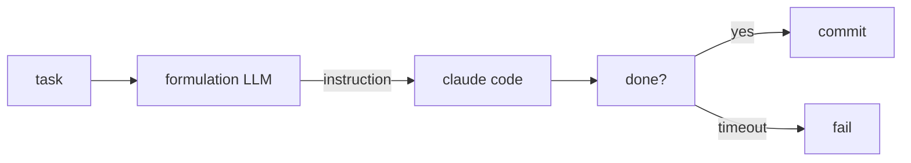

i don't trust public benchmarks. so i ran my own.


## context

i have an autonomous coding loop. the short version:



a task comes in from a backlog. a **formulation model** reads it and writes a detailed instruction. what to build, which files, what success looks like. then claude code executes that instruction. same executor every time.

the question: which formulation model actually produces instructions that lead to working code?

## the test

5 models on openrouter, randomly assigned per cycle:

```
minimax/minimax-m2.5
z-ai/glm-5
qwen/qwen3-coder-next
qwen/qwen3.5-plus-02-15
moonshotai/kimi-k2.5
```

success = claude code finishes the task, tests pass, files created. failure = incomplete work or errors.

52 active cycles.

## raw results

| model | cycles | successes | rate |
|-------|--------|-----------|------|
| minimax/minimax-m2.5 | 6 | 5 | **83.3%** |
| z-ai/glm-5 | 9 | 7 | **77.8%** |
| qwen/qwen3-coder-next | 13 | 10 | **76.9%** |
| qwen/qwen3.5-plus-02-15 | 6 | 3 | 50.0% |
| moonshotai/kimi-k2.5 | 7 | 3 | 42.9% |

from the validation report i built to track this:

```
============================================================
  formulation model performance
============================================================

  model                                    attempts  success     rate
  ---------------------------------------- -------- -------- --------
  minimax/minimax-m2.5                            6        5    83.3%
  z-ai/glm-5                                      9        7    77.8%
  qwen/qwen3-coder-next                          13       10    76.9%
  qwen/qwen3.5-plus-02-15                         6        3    50.0%
  moonshotai/kimi-k2.5                             7        3    42.9%
```

top 3 clustered at 77-83%. then a gap. then the bottom half.

## why kimi failed

this is the interesting part. kimi isn't dumb. it's too ambitious.

here's what kimi would formulate:

> "implement a fisher's exact test for statistical significance, build a comprehensive a/b validation framework with multiple dimensions of analysis, add cosine similarity for behavioral drift detection..."

meanwhile minimax would write:

> "add these fields to metrics.py. update the report. write tests. run pytest."

done in 60 seconds.

**over-specification kills.** claude code is smart enough to figure out details. it needs direction and a realistic scope, not a research paper. the bigger thinking models need room to breathe. kimi's formulations were genuinely thoughtful but the scope was too large for a single execution cycle.

## qwen3.5-plus vs qwen3-coder-next

same model family. 27-point gap. the "plus" adds verbosity that doesn't help. the coder variant is more focused, writes tighter instructions.

## what i did with this

trimmed to the top 3:

```python
# tested via a/b (2026-02-17, 52 cycles).
# top 3: minimax 83%, glm-5 78%, qwen3-coder 77%.
# dropped: kimi (43%), qwen3.5-plus (50%).
DEFAULT_FORMULATION_MODELS = [
    "minimax/minimax-m2.5",
    "z-ai/glm-5",
    "qwen/qwen3-coder-next",
]
```

added a `--model` flag so i can a/b test new models later without editing code:

```bash
# pin to one model
my-loop --autonomy --model minimax/minimax-m2.5

# test a subset
my-loop --autonomy --model z-ai/glm-5 --model qwen/qwen3-coder-next
```

## limitations

- sample sizes are small. 6-13 cycles per model. directional, not statistically significant.
- all cycles ran against the same task pool. different tasks might shuffle the rankings.
- the bigger thinking models might perform better with longer execution windows or multi-step task decomposition. this test measured single-shot formulation quality only.

## the point

run your own benchmarks on your own workload. takes a few hours. the results will contradict the leaderboards because leaderboards measure capability and you care about reliability in context.

for instruction-writing, concise wins. brevity is an asset. could be different for your use case.
